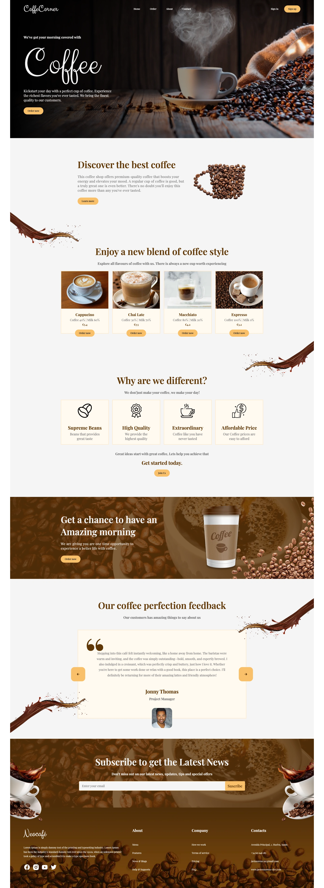

# ☕ Cafeteria SPA

This project is a website for a coffee shop designed as a **Single Page
Application (SPA)**. With a modern and responsive design, this website features
smooth animations and reusable components developed using **Vanilla
JavaScript**.

---

## 🚀 **Key Features**

- 🌟 **Modern Design**: Based on a free design from Figma.
- 🔄 **Reusable Components**: Organized and created with Vanilla JavaScript.
- 📱 **Responsive Design**: Adapted to different screen sizes.
- 🎞️ **Smooth Animations**: Implemented using JavaScript's **Intersection
  Observer API**.
- ⚡ **Built with Vite**: For a fast and modern development experience.

---

## 📸 **Preview**

---

## 🌐 **Project Link**

🔗 [Live version](https://coffe-corner.vercel.app/)

---

## 📬 Contact

[
